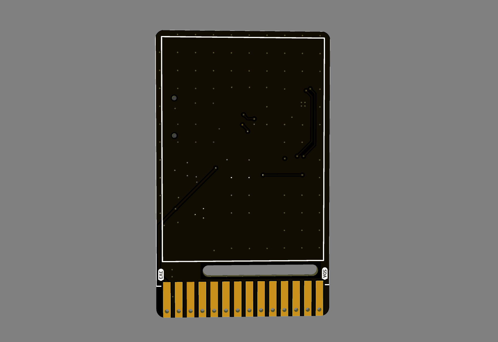
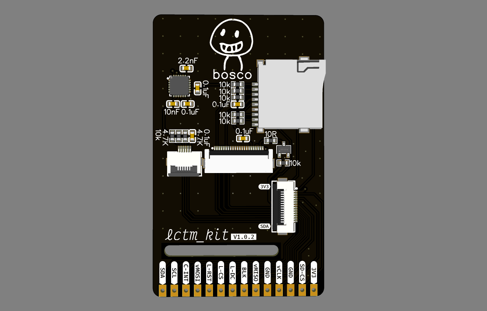
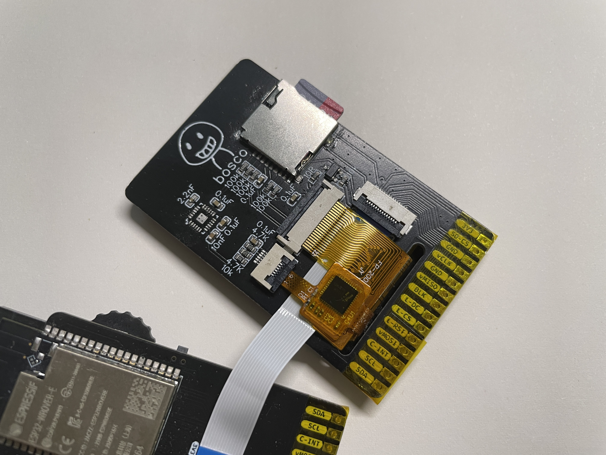
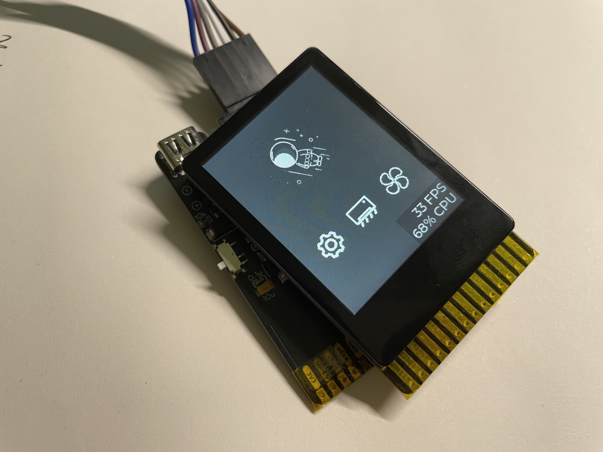

# LCTM-KIT

### **关键词**

- **ST7789**
- **FT6236**
- **SD CARD**
- **MPU6050**

### **简介**

使用ESP32学习lvgl时需要使用TFT屏幕，于是使用立创EDA画了块屏幕转接板，同时搭载了MPU6050和SD卡，支持HDR、FPC连接

### **实物图**

### **引脚说明**

| name  | 说明                         |
| ----- | ---------------------------- |
| 3V3   | +3.3V电源                    |
| SD-CS | SD CS引脚                    |
| GND   | GND                          |
| vCLK  | SPI CLK引脚                  |
| GND   | GND                          |
| VMISO | SPI MISO引脚                 |
| BLK   | LCD 背光控制引脚，高电平有效 |
| L-DC  | LCD DC引脚                   |
| L-CS  | LCD CS引脚                   |
| L-RST | LCD reset引脚                |
| vMOSI | SPI MOSI引脚                 |
| C-INT | 触摸中断引脚                 |
| SCL   | I2C SCL引脚                  |
| SDA   | I2C SDA引脚                  |

### **BOM表与焊接**

BOM表由iBOM生成，方便焊接👉  [PCB_2.0寸触摸屏_lctm-kit.html](Docs\PCB_2.0寸触摸屏_lctm-kit.html)  

另外，LCTM-KIT使用0603封装的电阻电容，比较好焊接，所有元器件均可在某宝购买

- 屏幕使用的是中景园的2寸LCD显示屏
- 电容触摸使用的是大显伟业2寸那款
- 屏幕使用双面胶固定在PCB板上

### **TODO**

- [x] 功能测试完成，均可使用
- [ ] 增加螺丝孔位固定